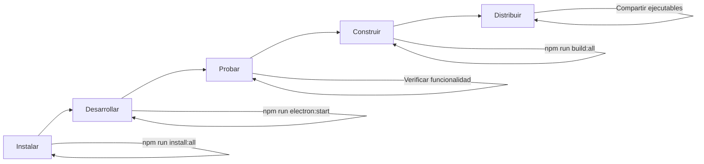

# 🎯 Resumen Rápido - Electron Setup

## ✅ ¿Qué se hizo?

Tu proyecto **Ciencias-2-Florez** ahora puede exportarse como:
- 🪟 **Windows**: Instalador .exe (NSIS)
- 🐧 **Linux**: AppImage portable

## 📦 Archivos Importantes

| Archivo | Descripción |
|---------|-------------|
| `electron.js` | Proceso principal de Electron (backend + ventana) |
| `preload.js` | Script de seguridad para Electron |
| `package.json` | Configuración de electron-builder |
| `build-electron.sh` | Script interactivo de construcción |
| `BUILD-CHECKLIST.md` | Lista de verificación completa |
| `QUICK-START-ELECTRON.md` | Guía rápida de comandos |
| `ELECTRON-README.md` | Documentación detallada |

## ⚡ Comandos Esenciales

```bash
# 1. Instalar dependencias (solo una vez)
npm run install:all

# 2. Probar con Electron
npm run electron:start

# 3. Construir ejecutables
npm run build:win     # Solo Windows
npm run build:linux   # Solo Linux
npm run build:all     # Ambas plataformas
```

## 📂 Salida

Los ejecutables se generan en: **`dist-electron/`**

```
dist-electron/
├── Simulador Ciencias 2-1.0.0-Setup.exe      # Windows
└── Simulador Ciencias 2-1.0.0.AppImage       # Linux
```

## 🎨 Antes de Construir

1. **Agrega un ícono** (recomendado):
   - Crear o descargar PNG de 512x512px
   - Guardar como: `frontend/public/icon.png`
   - Ver instrucciones en: `frontend/public/icon-placeholder.txt`

2. **Actualiza la versión** en `package.json`:
   ```json
   {
     "version": "1.0.0"
   }
   ```

3. **Prueba la aplicación**:
   ```bash
   npm run electron:start
   ```

## 📖 Documentación Completa

- **📋 Checklist**: `BUILD-CHECKLIST.md`
- **⚡ Inicio Rápido**: `QUICK-START-ELECTRON.md`
- **📚 Guía Completa**: `ELECTRON-README.md`
- **✅ Resumen de Setup**: `ELECTRON-SETUP-COMPLETE.md`

## 🚀 Flujo de Trabajo



## ⚠️ Nota Importante

El ícono es **opcional** pero **recomendado** para producción:
- ✅ Con ícono: Aplicación se ve profesional
- ⚠️ Sin ícono: Usa ícono predeterminado de Electron

## 🆘 Ayuda Rápida

### Error al construir
```bash
npm run install:all
npm run build:frontend
```

### Probar sin construir
```bash
npm run electron:start
```

### Ver documentación
```bash
cat QUICK-START-ELECTRON.md
```

---

**¡Todo listo!** Comienza con: `npm run electron:start` 🚀
